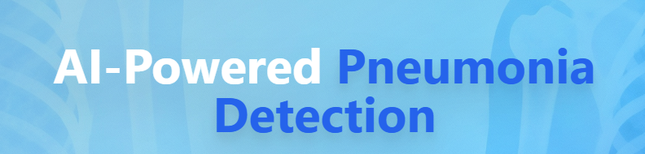
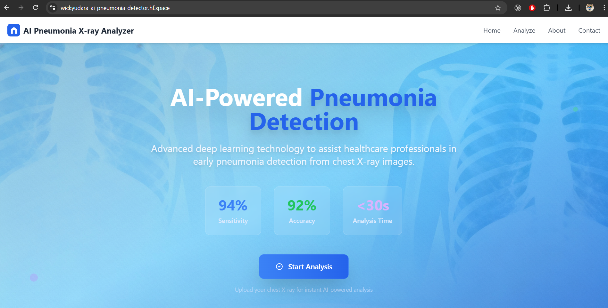
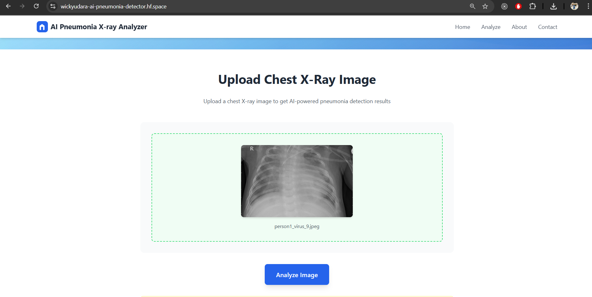
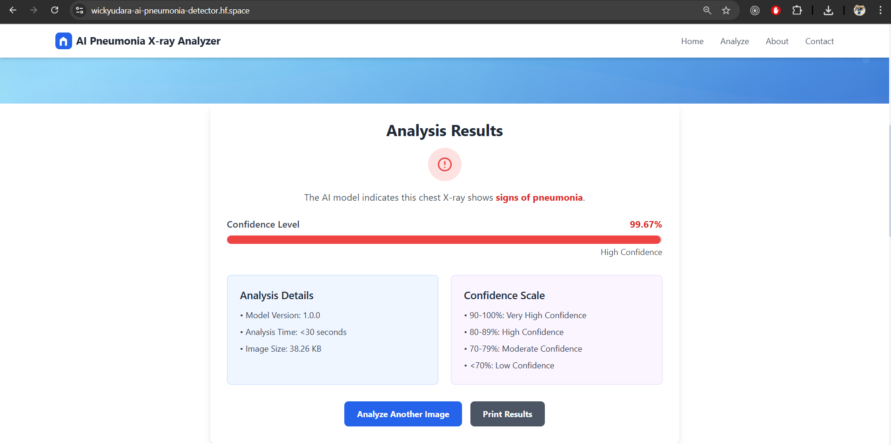

# ChestXRay AI Analyzer - Pneumonia Detection Full Stack Application

<div align="center">



[](https://www.python.org/downloads/)
[](https://fastapi.tiangolo.com/)
[](https://tensorflow.org/)
[](https://react.dev/)
[](https://www.docker.com/)
[](https://opensource.org/licenses/MIT)

**AI-Powered Pneumonia Detection from Chest X-Ray Images — Full Stack Application (Backend + React Frontend)**

[🚀 Live Demo](https://wickyudara-ai-pneumonia-detector.hf.space/) • [📖 Documentation](https://github.com/WickyUdara/Chest-X-Ray-Pneumonia-Detection/blob/main/readme.md) • [📊 Dataset](https://www.kaggle.com/datasets/paultimothymooney/chest-xray-pneumonia)

</div>

---

## 🎯 Overview

ChestXRay AI Analyzer is a **full stack AI application** for pneumonia detection from chest X-ray images. It combines a robust FastAPI backend with a modern React frontend for an end-to-end automated screening workflow. Users can upload X-ray images via an intuitive web interface, get instant predictions, and review results in a clinical-grade dashboard.

### Backend
- FastAPI REST API serving a custom CNN pneumonia detector
- TensorFlow model inference for fast and reliable classification

### Frontend
- Built with React for a fast, interactive user interface
- Medical-grade UI and confidence scoring
- Supports image upload, display, and detailed AI prediction view

---

## 🚀 Try It Live!

🔗 **Live Demo:** [https://wickyudara-ai-pneumonia-detector.hf.space/](https://wickyudara-ai-pneumonia-detector.hf.space/)

---

## ✨ Key Features

- 🧠 **Custom CNN** for medical image analysis
- ⚡ **Instant Results** — AI inference in under 1 second
- 🎯 **High Accuracy** (up to 93%) with strong sensitivity/specificity
- 🏥 **Clinical Dashboard** with React frontend
- 🔒 **Secure & Validated Backend** with FastAPI
- 📱 **RESTful API + Modern UI** for easy integration
- 🐳 **Dockerized** for deployment anywhere

---

## 🤖 Model Architecture

Custom CNN model pipeline:

```
Input (150x150x3)
 → Conv2D + ReLU + MaxPool2D
 → Conv2D + ReLU + MaxPool2D
 → Conv2D + ReLU + MaxPool2D
 → Flatten + Dropout
 → Dense + ReLU + Dropout
 → Dense + Sigmoid
```

---

## 📊 Dataset

- **Source:** [Kaggle Chest X-Ray Images (Pneumonia)](https://www.kaggle.com/datasets/paultimothymooney/chest-xray-pneumonia)
- **Total Images:** 5,863 (Normal: 1,583 | Pneumonia: 4,280)
- **Training:** 5,216 | **Validation:** 16 | **Test:** 624

---

## 🏗️ Full Stack Project Structure

```
Chest-XRay-Pneumonia-Detection/
├── backend/
│   ├── app/
│   │   └── main.py
│   ├── models/
│   │   └── pneumonia_model.h5
│   └── requirements.txt
│
├── frontend/
│   ├── public/
│   │   └── index.html
│   ├── src/
│   │   ├── components/
│   │   │   ├── About.js
│   │   │   ├── Footer.js
│   │   │   ├── Header.js
│   │   │   ├── Hero.js
│   │   │   ├── ImageUploader.js
│   │   │   ├── Results.js
│   │   │   └── ThemeToggler.js
│   │   ├── context/ThemeContext.js
│   │   ├── App.js
│   │   ├── index.css
│   │   └── index.js
│   ├── package.json
│   ├── tailwind.config.js
│   └── postcss.config.js
│
├── .env
├── .gitignore
└── README.md
```

---

## 🚀 Quick Start

### Backend Setup

1. **Clone the repo**
```bash
git clone https://github.com/your-username/chestxray-pneumonia-backend.git
cd chestxray-pneumonia-backend/backend
```
2. **Install dependencies & model**
```bash
python -m venv venv
source venv/bin/activate  # On Windows: venv\Scripts\activate
pip install -r requirements.txt
cp your_model.h5 models/pneumonia_model.h5
```
3. **Run the API**
```bash
uvicorn app.main:app --host 0.0.0.0 --port 8000
```
---

### Frontend Setup

1. **Install and start React app**
```bash
cd ../frontend
npm install
npm start
```
The web app is available at `http://localhost:3000`.

---

### Docker Full Stack Deployment

1. **Build and run with Docker Compose**
```bash
docker-compose up --build
```

---

## 📖 API Usage

- POST `/predict` — Upload a chest X-ray image, get prediction and confidence score
- GET `/` — Health check

Example:
```python
import requests
files = {'file': open('chest_xray.jpg','rb')}
r = requests.post('http://localhost:8000/predict', files=files)
print(r.json())
```

---

## 🖼️ Screenshots

### Main Dashboard


### Upload & Prediction


### AI Results


---

## ⚠️ Medical Disclaimer

**This application is for research/educational use only and NOT for clinical diagnosis. Always consult healthcare professionals before making decisions.**

---

## 📄 License

MIT License - see [LICENSE](LICENSE)

---

## 🙏 Acknowledgments

- Kaggle Dataset: Kermany et al. (2018)
- FastAPI and TensorFlow teams
- React contributors

---

<div align="center">
Made with ❤️ for healthcare and AI innovation.
</div>
